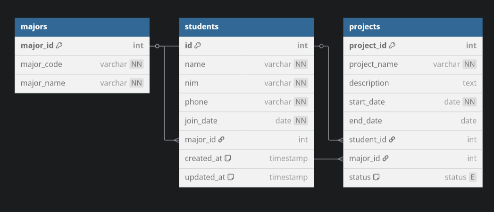
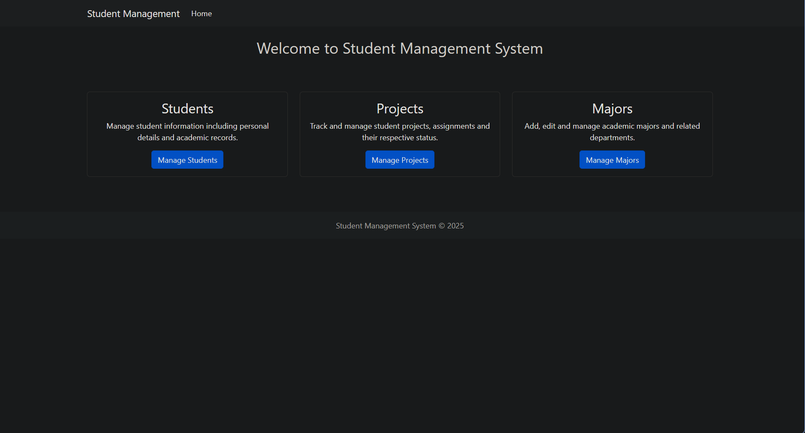
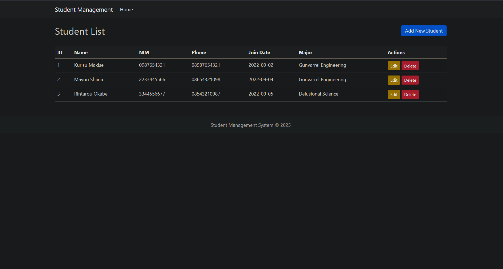
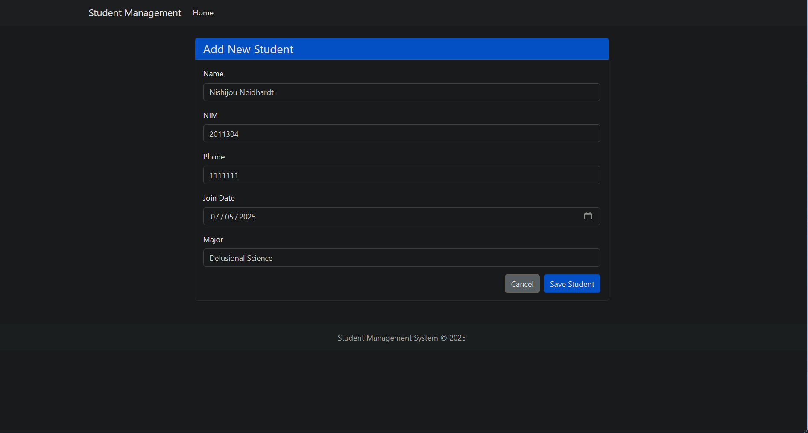
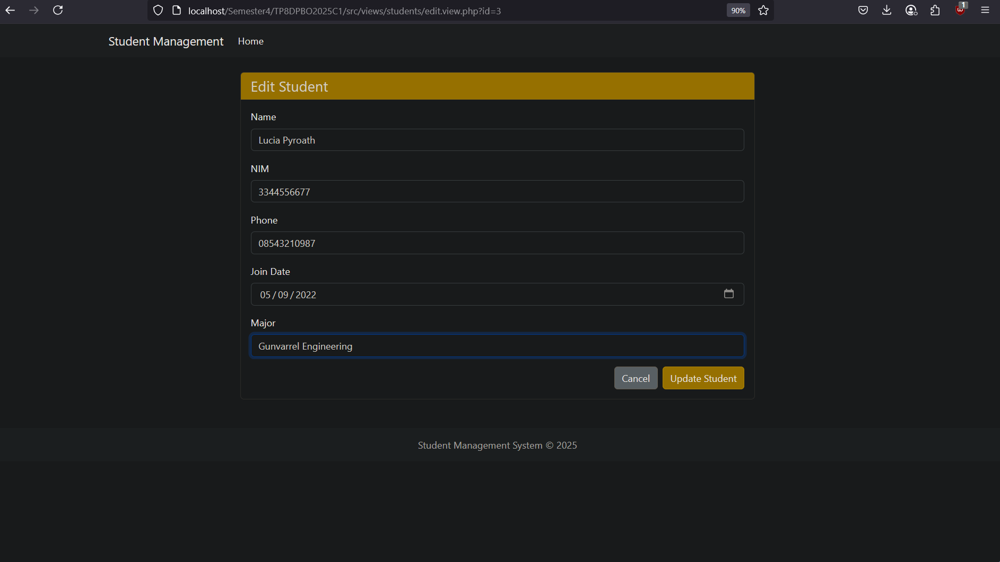
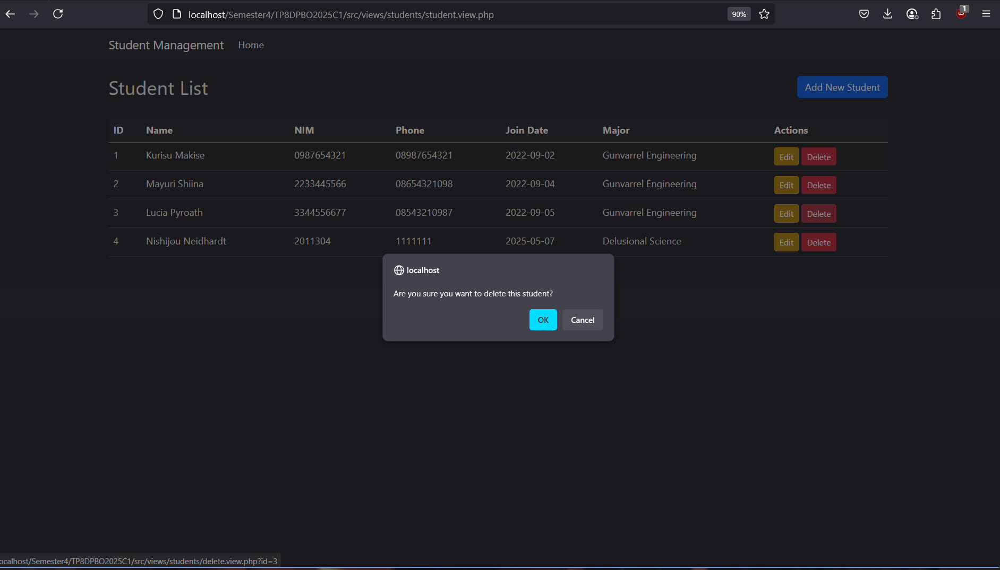
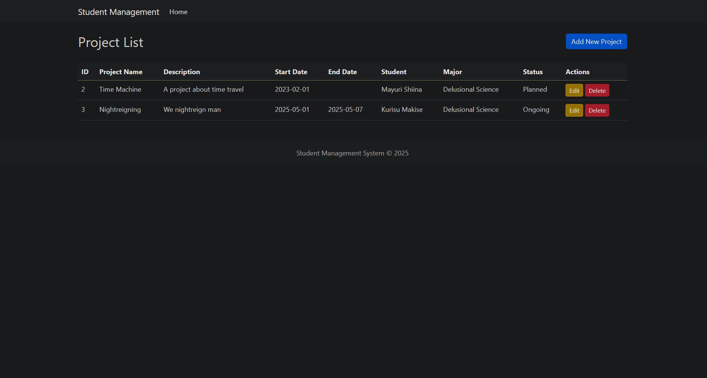
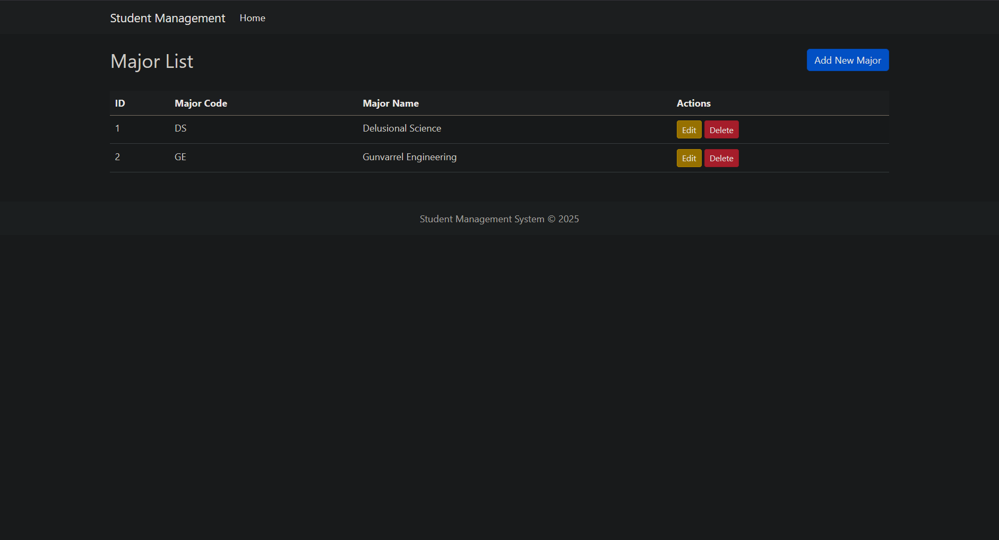

# Student Management System

## Janji

Saya Lyan Nazhabil Dzuquwwa dengan NIM 2308428 mengerjakan Tugas Praktikum 8 dalam mata kuliah Desain dan Pemrograman Berorientasi Objek untuk keberkahanNya maka saya tidak melakukan kecurangan seperti yang telah dispesifikasikan. Aamiin.

## Diagram
Berikut merupakan Diagram ERD dari program:

## Desain Program

Program ini mengimplementasikan sistem manajemen untuk mahasiswa dengan konsep Object-Oriented Programming. Terdapat beberapa kelas utama:

1. **Student** - Kelas untuk mengelola data mahasiswa
   - Atribut: id, name, nim, phone, join_date, major_id, created_at, updated_at
   - Method: getId(), setId(), getName(), setName(), getNim(), setNim(), getPhone(), setPhone(), getJoinDate(), setJoinDate(), getMajorId(), setMajorId(), getCreatedAt(), setCreatedAt(), getUpdatedAt(), setUpdatedAt()

2. **Project** - Kelas untuk mengelola data proyek mahasiswa
   - Atribut: project_id, project_name, description, start_date, end_date, student_id, major_id, status
   - Method: getProjectId(), setProjectId(), getProjectName(), setProjectName(), getDescription(), setDescription(), getStartDate(), setStartDate(), getEndDate(), setEndDate(), getStudentId(), setStudentId(), getMajorId(), setMajorId(), getStatus(), setStatus()

3. **Major** - Kelas untuk mengelola jurusan akademis
   - Atribut: major_id, major_code, major_name
   - Method: getMajorId(), setMajorId(), getMajorCode(), setMajorCode(), getMajorName(), setMajorName()

Setiap kelas mengimplementasikan operasi CRUD (Create, Read, Update, Delete) untuk entitas masing-masing.

## Alur Program

Pertama-tama, terdapat halaman awal atau index page dengan tampilan berikut:

Dari halaman utama, pengguna dapat mengakses tiga fitur utama sistem:

### Mengelola Mahasiswa (Students)
Pada halaman ini pengguna dapat:
- Melihat daftar seluruh mahasiswa
- Menambah data mahasiswa baru
- Mengubah data mahasiswa yang sudah ada
- Menghapus data mahasiswa (Catatan: mahasiswa yang masih terkait dengan proyek tidak dapat dihapus)

Untuk menambah data mahasiswa, pengguna mengisi formulir yang tersedia dengan nama, NIM, nomor telepon, tanggal bergabung, dan jurusan:

Untuk mengubah data, pengguna dapat mengklik mahasiswa yang ingin diubah:

Jika pengguna ingin menghapus data, sistem akan menampilkan konfirmasi terlebih dahulu:

### Mengelola Proyek (Projects)
Pada halaman proyek, pengguna dapat:
- Melihat daftar seluruh proyek
- Menambah proyek baru dengan nama, deskripsi, tanggal mulai dan selesai
- Mengaitkan proyek dengan mahasiswa dan jurusan tertentu
- Mengubah detail proyek
- Menghapus proyek

### Mengelola Jurusan (Majors)
Halaman jurusan memungkinkan pengguna untuk:
- Melihat daftar jurusan yang tersedia
- Menambah jurusan baru dengan kode dan nama jurusan
- Mengubah data jurusan
- Menghapus jurusan (Catatan: jurusan yang masih terkait dengan mahasiswa atau proyek tidak dapat dihapus)

## Dokumentasi
Berikut demo websitenya:
